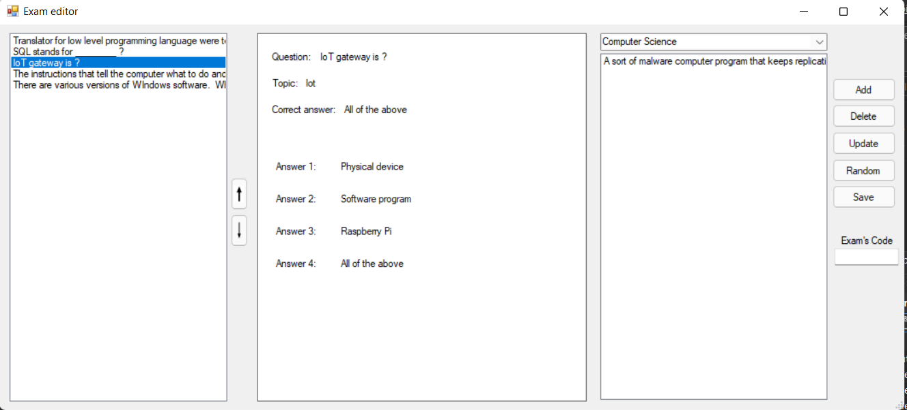
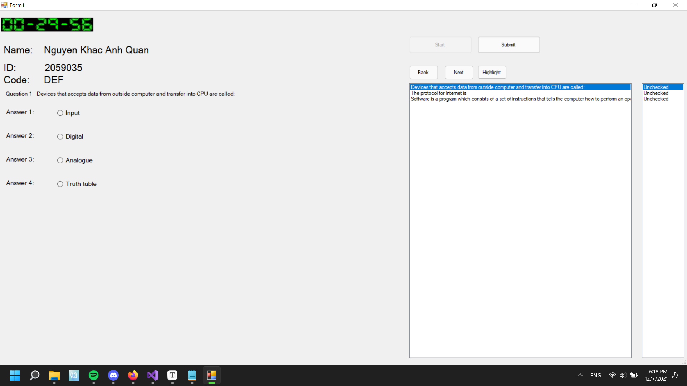

# FinalSeminar
## Exam Creator and Exam Taker

**This project was done by:**

* Nguyễn Khắc Anh Quân (2059035)
* Nguyễn Quốc Thư (2059044)

### Self evaluation: 90%
Our project have done most of the requirements from the instruction. Though, there might be some hidden issues that we missed during the process. Furthermore, the application is not at its best form yet.

---
***This project contains 2 applications: Exam editor module and Test module*** 

### Exam Editor:
There are 4 parts in this program: Starting screen, Question editor, Exam editor, Exam marker.

#### Starting screen

 
The starting screen will have 3 buttons for user to choose, similar to the other 3 parts of the program 

#### Question editor:  
  
After choosing question editor option, it will lead you to the program designed for creating, editing question and saving those question into a Question database. 

 

**Special features:** Ability to have as many answers per question as needed

 
 

#### Exam editor:

 
 

As for the exam editor button, pressing the button will lead you to a program developed for creating, editing exam for later use. 
There are 3 ways for you to create or open an exam:

* Custom: you will start with a blank exam to customize it the way you want
* Randomize: you will be asked for a number of question. After entering the number, the program will randomly pick questions from the database and import it into the exam. Despite that, you can still customize the exam again by yourself
* Open an existed exam: you had made an exam and you want to modify it, this is the option for that.

**Special feature**: Ability to change the order of the questions through 2 buttons: Up arrow and Down arrow

**The up arrow:** allows you to move the question up to the afore index.

**The down arrow:** allows you to move the question down the after index.

 

#### Exam marker:

Exam marker does not have a specific menu. When you choose this option, it will lead you straight to the Folder explorer where you pick the folder that contains all the examinee's answers xml files. After that, it will go through every single file to mark, temporarily save them then ask for a path to export those result into a txt file. This is an example of the file after being processed:

## Exam taker

This program is made for examinee to take the pre-made exam. When opening it, it will lead you to an open file dialog filtered to .xml file only. You pick the exam file, enter your information and begin your test. When you are finished or time is up, you can submit your answers and it will export another xml file for the previous mentioned exam marker to check. It contains only 1 main menu with all the features in it.

The timer's source code was made by Mr. Nguyễn Đức Huy. We only use this for educational purposes.

**Special feature:**

* Ability to see whether that question is checked or not

  

* Ability to highlight a question that you want to come back later

  
